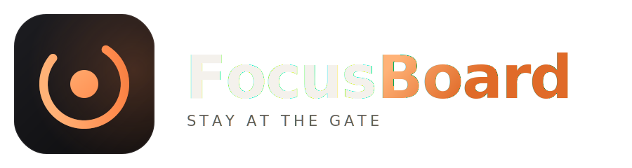

<div align="center">



<br />

**A local companion for Claude Code — watch the agent work instead of doom-scrolling, and X-ray exactly where your tokens go.**

No dependencies · No models · No cloud · Runs entirely on your machine

</div>

---

## The problem

There's a dead gap between hitting enter in Claude Code and getting a response. The wait is unpredictable — 5 seconds or 90 — so your brain bails to your phone, and focus is gone. It's not just one person's problem; it's most developers' problem.

FocusBoard turns that black box into a live "departures board" you keep beside your terminal, and — as a bonus — mines the same data Claude Code already records to show you where your tokens and dollars actually went.

## Features

### 🛬 Live board
A small page that mirrors what the agent is doing **right now**, fed by Claude Code's hooks and its running transcript:

- **Phase indicator** — `🧠 Thinking → ✍️ Writing → 🔧 Using tools`, so you always know it's alive.
- **Live answer streaming** — the reply types itself out on the board as it's generated, even on turns that use no tools. Your eyes stay on the laptop, not the phone.
- **Activity feed** — every file read, edit, and command, in plain English.
- **Done signal** — when the turn finishes you get a sound + a desktop notification, so you can step away guilt-free and come back the instant it's ready.
- **Parking lot** — jot your next thought while you wait instead of grabbing your phone. Saved to disk.

### 📊 Token X-ray
A deep, accurate breakdown of your Claude Code usage — built from the token counts Claude Code already writes to every transcript, so the numbers are **exact, not estimated**:

- **Tokens vs. money** — the same usage shown two ways. Most of your tokens are cheap cache reads; the dollars land somewhere else entirely. Seeing both side-by-side tells you the real cost lever.
- **Per session** — every session listed by its real title (not a UUID), sorted by spend. Drill into any one for its own breakdown and a ranked list of its priciest queries.
- **"This session"** — your active session is featured up top and updates live.
- **By model** — spend split across Opus / Sonnet / etc., priced with the exact 5-minute vs. 1-hour cache-write rates.

## How it works

Two local data sources, zero external calls:

1. **Hooks** — Claude Code runs a one-line `curl` on each event (prompt submitted, tool used, turn finished). Each ping posts to a tiny local server. If the server isn't running, `curl` fails instantly, so it *never* slows your agent down.
2. **The transcript** — Claude Code writes a running log of each session (including per-message token usage). A background watcher tails the current turn for the live answer and phase; the Token X-ray scans all transcripts for usage analytics.

The server is ~plain Python standard library. No `pip install`, no model, no cost.

```
You hit enter
   │
   ▼
Claude Code hook ──curl──► local server (port 8137) ──► board polls /state and redraws
   ▲                              │
   └──── transcript file ◄────────┘  (watched for live answer + token usage)
```

## Quick start

**1. Start the server**

```bash
python server.py
```

Then open **http://localhost:8137** in a browser tab next to your terminal.

**2. Wire up the hooks** — add this to `~/.claude/settings.json` (merge into any existing `"hooks"`):

```json
{
  "hooks": {
    "UserPromptSubmit": [
      { "hooks": [ { "type": "command", "command": "curl -s -m 2 -X POST http://localhost:8137/event -H \"Content-Type: application/json\" --data-binary @-" } ] }
    ],
    "PreToolUse": [
      { "matcher": "", "hooks": [ { "type": "command", "command": "curl -s -m 2 -X POST http://localhost:8137/event -H \"Content-Type: application/json\" --data-binary @-" } ] }
    ],
    "Stop": [
      { "hooks": [ { "type": "command", "command": "curl -s -m 2 -X POST http://localhost:8137/event -H \"Content-Type: application/json\" --data-binary @-" } ] }
    ],
    "Notification": [
      { "matcher": "idle_prompt", "hooks": [ { "type": "command", "command": "curl -s -m 2 -X POST http://localhost:8137/event -H \"Content-Type: application/json\" --data-binary @-" } ] }
    ]
  }
}
```

**3. Restart Claude Code** so it picks up the hooks, then send any prompt and watch the board light up.

> The Token X-ray works even before any hooks are set up — it reads transcripts that already exist on disk.

## Privacy

Everything stays on your machine. The server binds to `localhost` only, makes no outbound network calls, and uses no AI model. It reads your local Claude Code transcripts (`~/.claude/projects/`) purely to compute analytics — nothing leaves your computer.

## Project structure

| File | Purpose |
|------|---------|
| `server.py` | Zero-dependency local server: receives hook events, watches the transcript, serves the pages, computes token analytics |
| `index.html` | The live board |
| `tokens.html` | The Token X-ray dashboard |
| `demo.html` | A self-contained visual demo of the live board |

## Roadmap

- One-click launcher / auto-start on login
- Fold subagent tokens into the X-ray
- Per-day spend trend and "today" filter
- A "next-prompt queue" parking lot

## License

MIT
